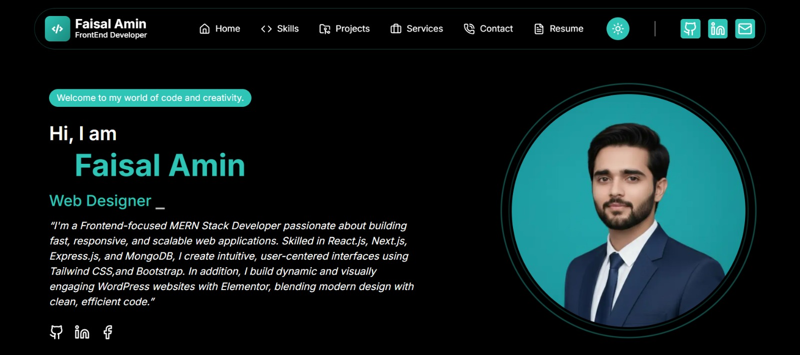

# 👨‍💻 Faisal Ameen Portfolio

<p align="center">
  
</p>

<p align="center">
  Software Engineer | Full-Stack Web Developer | React • Next.js • Node.js • PostgreSQL
</p>

<p align="center">
  A modern portfolio website showcasing my projects, skills, experience, and professional journey.
</p>

---

## 🚀 Live Demo

🔗 https://faisalportfolio-beta.vercel.app/

---

## 📖 Overview

This portfolio website was built to showcase my professional experience, technical skills, and software development projects. The platform provides visitors with a comprehensive view of my work, achievements, and contact information through a clean and interactive user experience.

---


## ✨ Features

* Modern and responsive portfolio design
* Dynamic project showcase section
* Skills and technology highlights
* Smooth page transitions and animations
* Contact form integration
* Mobile-friendly user experience
* SEO optimized structure
* Fast performance and accessibility

---

## 🛠 Tech Stack

* Next.js
* React.js
* JavaScript
* Tailwind CSS
* Framer Motion
* Email.js
* Lucide React Icons
* Vercel

---

## 📂 Project Structure

```text
app/
public/
components/
data/
hooks/
styles/
utils/
```

## ⚙️ Installation

Clone the repository:

```bash
git clone <repository-url>
```

Install dependencies:

```bash
npm install
```

Start the development server:

```bash
npm run dev
```

Open:

```text
http://localhost:3000
```

---

## 🌟 Sections Included

* Hero Section
* About Me
* Skills
* Experience
* Projects
* Contact Form
* Social Links

---

## 👨‍💻 Developer

### Faisal Ameen

Software Engineer | Full-Stack Web Developer

📧 Open to freelance, remote, and full-time opportunities.

Portfolio:
https://faisalportfolio-beta.vercel.app/

LinkedIn:
https://www.linkedin.com/in/faisal-ameen07/

GitHub:
https://github.com/FaisalAmeen07

---

## 📄 License

This project is open source and available under the MIT License.
